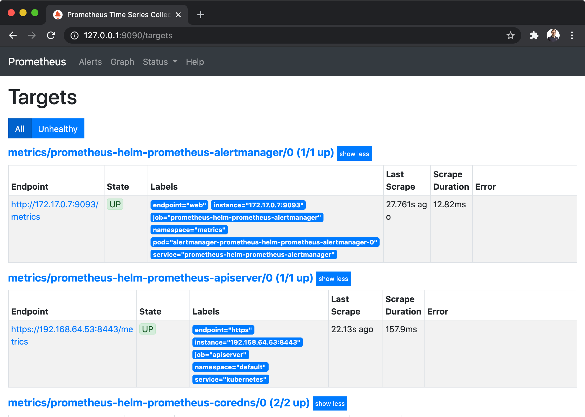
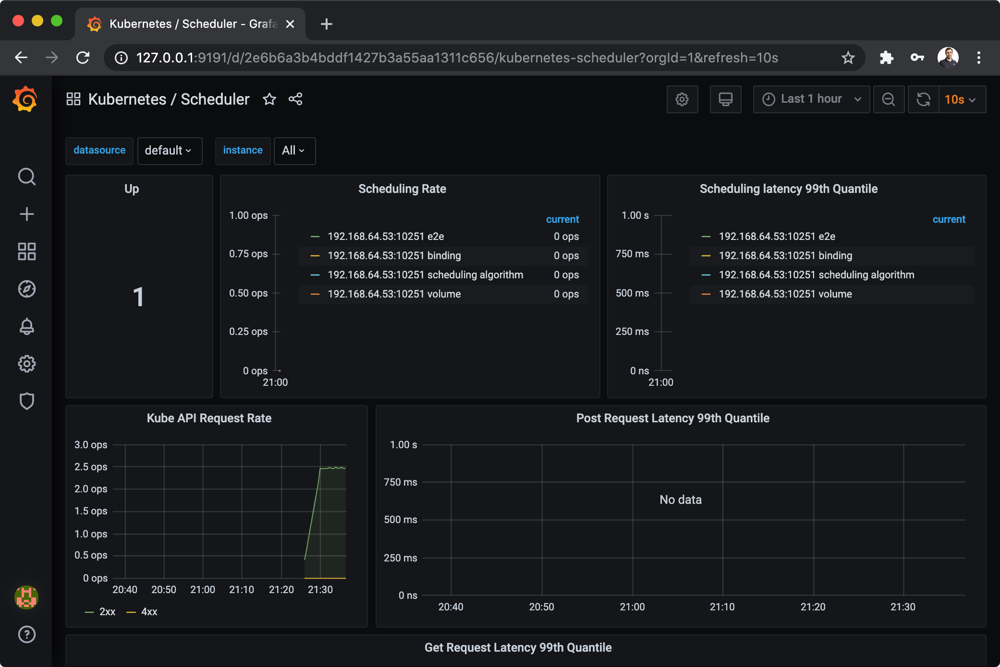
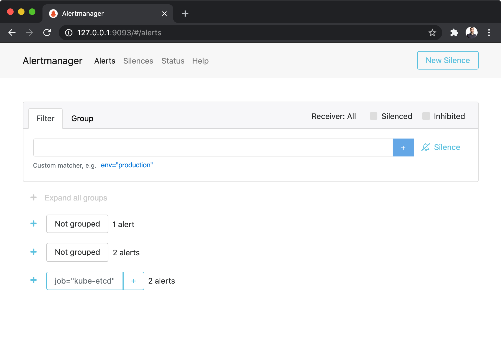

# Prometheus Setup


## Deploy Prometheus/Grafana/Alertmanager
```bash
❯ plz run //components/prometheus:deploy
```
* Creates `metrics` namespace
* Deploys the Prometheus Operator
* Deploys a Grafana
* Deploys a Alertmanager

Verify pods are healthy:
```bash
❯ kubectl -n metrics get pods
NAME                                                     READY   STATUS      RESTARTS   AGE
alertmanager-prometheus-helm-prometheus-alertmanager-0   2/2     Running     0          6s
prometheus-helm-grafana-5fc87c9979-vszqg                 2/2     Running     0          76s
prometheus-helm-grafana-test                             0/1     Completed   0          23s
prometheus-helm-kube-state-metrics-6cbf48fd46-8qzff      1/1     Running     0          75s
prometheus-helm-prometheus-admission-create-ldjmd        0/1     Completed   0          23s
prometheus-helm-prometheus-admission-patch-kk4fx         0/1     Completed   1          23s
prometheus-helm-prometheus-node-exporter-pppzv           1/1     Running     0          76s
prometheus-helm-prometheus-operator-d5c9f5675-dh5kd      2/2     Running     0          75s
```


## Access UIs
```bash
❯ plz run //components/prometheus:ui
```
* Forwards the Prometheus Service to http://127.0.0.1:9090



* Forwards the Grafana UI to http://127.0.0.1:9191



* Forwards the Alertmanager Service to http://127.0.0.1:9093




## References
* [Prometheus Operator](https://github.com/coreos/prometheus-operator)
* [Kubernetes monitoring with Prometheus in 15 minutes](https://itnext.io/kubernetes-monitoring-with-prometheus-in-15-minutes-8e54d1de2e13)
* [Kubernetes Monitoring with Prometheus](https://sysdig.com/blog/kubernetes-monitoring-prometheus/)
