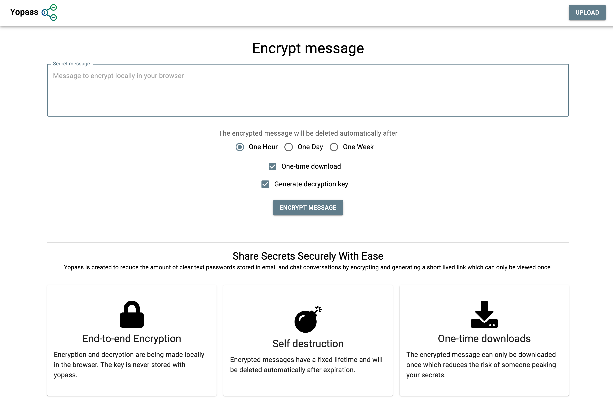

# Yopass Setup

[Yopass](https://github.com/jhaals/yopass) is a project for sharing secrets in a quick and secure manner


## Deploy yopass

```bash
❯ plz run //components/yopass:deploy [minikube|baremetal]
```
* Creates `yopass` namespace
* Deploys Yopass

Verify pods are healthy:
```bash
❯ kubectl -n yopass get pods
NAME                         READY   STATUS    RESTARTS   AGE
yopass-5b98b66b8d-j5jmr      0/2     Running   0          101s
```


---


## Access the Yopass UI

### Via Port-Forward

* Forward the Yopass UI to http://127.0.0.1:1337
```bash
❯ plz run //components/yopass:ui
```




### Via Ingress on Baremetal

* Verify the Ingress has been deployed:
```bash
❯ kubectl -n yopass get ingress
NAME             CLASS    HOSTS                         ADDRESS   PORTS   AGE
yopass-ingress   <none>   yopass.192.168.1.151.nip.io             80      8m45s
```

📝 **NOTE**: before deploying, make sure to replace the host IP address in: `//components/yopass/deployment/overlays/baremetal/ingress.yaml`

This assumes you followed the setup described at "[Kubernetes Lab on Baremetal](https://www.marcolancini.it/2021/blog-kubernetes-lab-baremetal/)".
