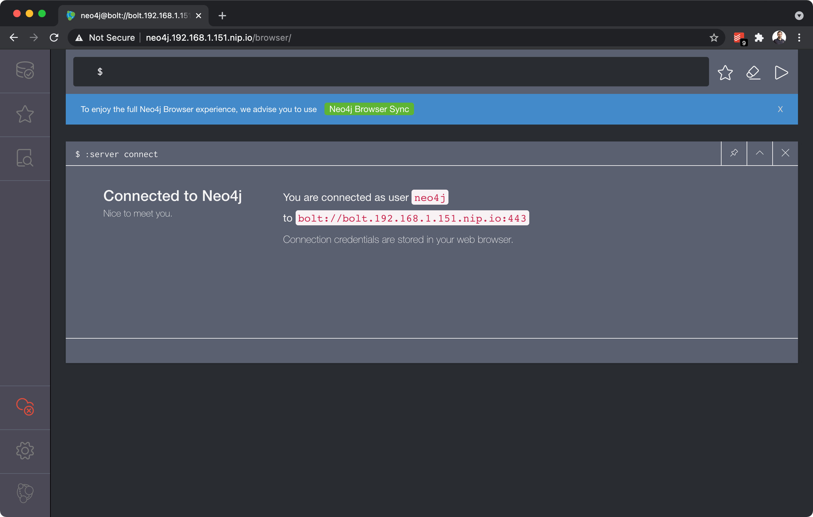

# Cartography Setup

[Cartography](https://github.com/lyft/cartography) is a Python tool that consolidates infrastructure assets and the relationships between them in an intuitive graph view powered by a Neo4j database.

## Prerequisites

| Component                  | Instructions                                                                                                                                                                                                                                                                                                                                                                                                                                                                                                                                                                                                           |
| -------------------------- | ---------------------------------------------------------------------------------------------------------------------------------------------------------------------------------------------------------------------------------------------------------------------------------------------------------------------------------------------------------------------------------------------------------------------------------------------------------------------------------------------------------------------------------------------------------------------------------------------------------------------- |
| Vault                      | ⚠️ This module depends on a Vault installation. Please refer to [Vault Setup](vault.md) for more information.                                                                                                                                                                                                                                                                                                                                                                                                                                                                                                           |
| Cloud Provider Credentials | <ul><li>You will need to generate access tokens for Cartography to use.</li><li>For example, for AWS:<ul><li>You can use the [aws-security-reviewer](https://github.com/marco-lancini/utils/tree/main/terraform/aws-security-reviewer) Terraform module to automate the setup of roles and users needed to perform a security audit of AWS accounts in an Hub and Spoke model.</li><li>Then, generate access keys for the IAM user and keep them ready to use.</li><li>Add the accounts that needs to be ingested to `//components/cartography/deployment/cartography/aws-accounts-configmap.yaml`</li></ul></li></ul> |


---


## Deploy Cartography and Neo4j
```bash
❯ plz run //components/cartography:deploy [minikube|baremetal]
```
* Setup namespace: creates a `cartography` namespace, and a Vault Agent service account
* Setup and Deploy Neo4j:
  * Generates a random password for Neo4j and stores it into Vault
  * Generates TLS Certificates
  * Created a StorageClass, PersistentVolume, and Ingress (baremetal only)
  * Deploys the Neo4j StatefulSet and Service
* Setup and Deploy Cartography:
  * Creates a custom Docker image for Cartography
  * Requests user to provide access key, secret key, and Account ID of the Hub
  * Setup Vault:
    * Enables the AWS secrets engine
    * Persists the credentials that Vault will use to communicate with AWS
    * Configures a Vault role that maps to a set of permissions in AWS
  * Deploys the Cartography CronJob, scheduled to run every day at 7am

Verify pods are healthy:
```bash
❯ kubectl -n cartography get po
NAME                  READY   STATUS    RESTARTS   AGE
neo4j-statefulset-0   2/2     Running   0          5h56m
```

Manually trigger the execution of a Cartography Job:
```bash
❯ kubectl -n cartography create job --from=cronjob/cartography-run cartography-run
```

📝 **NOTE FOR BAREMETAL**: before deploying, make sure to prepare
the data folder on the host (and to remove the same folder to reset the installation):
```bash
❯ sudo mkdir -p /etc/plz-k8s-lab/cartography/neo4j/
❯ sudo chmod -R a+rw /etc/plz-k8s-lab/cartography/
```


---


## Access the Neo4J  UI

### Via Port-Forward
* Forward the Vault UI to http://127.0.0.1:7474
```bash
❯ plz run //components/vault:ui [minikube|baremetal]
```

### Via Ingress on Baremetal
* Verify the Ingresses have been deployed:
```bash
❯ kubectl -n cartography get ingress
NAME                 CLASS    HOSTS                        ADDRESS   PORTS     AGE
neo4j-ingress        <none>   neo4j.192.168.1.151.nip.io             80, 443   6h7m
neo4j-ingress-bolt   <none>   bolt.192.168.1.151.nip.io              80, 443   6h7m
```

* 📝 **NOTE**: before deploying, make sure to replace the host IP address in:
  *  `//components/cartography/baremetal/neo4j-ingress.yaml`
  *  `//components/cartography/setup/neo4j.sh`
This assumes you followed the setup described at "[Kubernetes Lab on Baremetal](https://www.marcolancini.it/2021/blog-kubernetes-lab-baremetal/)".

* To access the Neo4j web UI:
  * Browse to: https://neo4j.192.168.1.151.nip.io/browser/
  * Connect URL: `bolt://bolt.192.168.1.151.nip.io:443`
  * Username: `neo4j`
  * Password: stored in Vault at `secret/cartography/neo4j-password`




---


## References
* [cartography](https://github.com/lyft/cartography)
* [Cross Account Auditing in AWS and GCP](https://www.marcolancini.it/2019/blog-cross-account-auditing/)
* [Terraform AWS Security Reviewer](https://github.com/marco-lancini/utils/tree/main/terraform/aws-security-reviewer)
* [Kubernetes Lab on Baremetal](https://www.marcolancini.it/2021/blog-kubernetes-lab-baremetal/)
